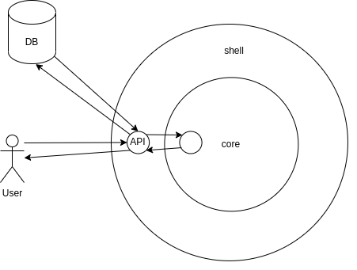

# Functional Core, Imperative Shell Pattern

When working with highly opinionated frameworks that are designed around a rigid layering paradigm like *Model/View/Controller* and its variants, it often happens that parts of the business logic are present on all 3 layers, and even leak to the software's external layers, like the database and the UI.

The business logic is a set of rules that should never be violated. If these rules live in multiple different places, they will be enforced differently, evolve differently, get out of sync, and eventually be violated. It's in our best interest to keep the business logic centralized and tight so that it can be understood, tested and allowed to evolve freely. This is the main idea behind *Domain Driven Design (DDD)*.

The *Functional Core, Imperative Shell* pattern is a variation of the *DDD*, with the main ideas being:

- Software is divided into two main entities; The (functional) core and the (imperative) shell.
- The core contains the domain/business logic. It is ideally implemented in a functional way, with pure functions and immutable data structures.
- The shell contains the interactions with the outside world, like incoming requests, database persistence, etc. 
- The core is not aware of the shell's existence. The shell however can call the core and make use of its business logic.

So in essense the core:
 - Contains pure business logic
 - No side effects
 - Easy to test
 - Completely predictable

The shell, on the other hand, is a thin layer around the core that:
- Handles all side effects (database I/O, HTTP, etc)
- Acts as a mediator between the external world and the core

## Diagram 
The diagram below illustrates the basic idea.



- The user sends a request to the web API, which is implemented in the *shell* layer. 
- The API adapts the request to some data structure that can be understood by the core. 
- It then calls a *core* function and provides the data structure as input. The *core* performs the business logic on the data, and returns a new data structure. The API then, persists the new data structure to the database, and returns the response to the user.


## Example

The example of this repository illustrates a small scenario that implements the pattern. The codebase is structured as follows:

- `/src/core`: Pure functional core with business logic
  - `/src/core/models.py`: Defines the data model, as a Pydantic model class. In our case it's just the `TaskModel` class.
  - `/src/core/operations.py`: Defines the functionality of the model.

- `/src/shell`: Imperative outer layer that sets up all external frameworks, tools and scripts that interact with the core
  - `/src/shell/db`: Configures the database and defines the data model
    - `/src/shell/db/session.py`: Configures the database connection and defines the logic for obtaining a database session
    - `/src/shell/db/models.py`: Defines the database model `Task` using SQLAlchemy.
  - `/src/shell/api`: API application
    - `/src/shell/api/app.py`: Configures the application and defines its endpoints.
  - `/src/shell/scripts`: Standalone scripts
    -  `/src/shell/scripts/print_tasks.py`: Print the existing `Task` items. 
- `/entrypoints`: Contains the executables that run  the `shell` components.


## How to run

```
docker-compose up --build
```

Once the application is up and running, visit `localhost:8000/docs` to view the API documentation.